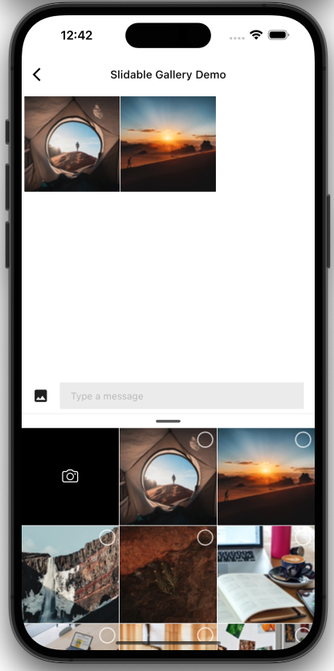
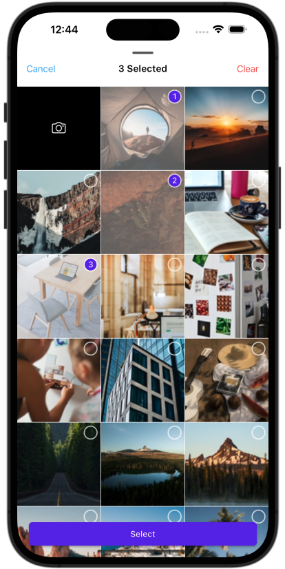

# Gallery Asset Picker

A gallery picker and camera in one package. The Gallery and Camera views can both be utilized as Flutter widgets

---

## Table of contents

- [Screenshot](#screenshot)
- [Install](#install)
- [Setup](#setup)
- [Usage](#usage)
- [Bugs or Requests](#bugs-or-requests)

---

## Screenshot

|                  Collapse Mode                   |                   Expand Mode
| :----------------------------------------------: | :----------------------------------------------:
|  | 

---

## Install

### 1. Add dependency

Add this to your package's `pubspec.yaml` file:

```yaml
dependencies:
  gallery_asset_picker: ^latest_version
```

### 2. Import it

Now in your `Dart` code, you can use:

```dart
import 'package:gallery_asset_picker/gallery_asset_picker.dart';
```

---

## Setup

For more details (if needed) you can go through <a href="https://pub.dev/packages/photo_manager">Photo Manager</a> and <a href="https://pub.dev/packages/camera">Camera</a> readme section as well.

### 1. Android

- Change the minimum Android sdk version to 21 (or higher) in your `android/app/build.gradle` file.

```gradle
minSdkVersion 21
```

- Required permissions: `READ_EXTERNAL_STORAGE`, `WRITE_EXTERNAL_STORAGE`, `ACCESS_MEDIA_LOCATION`.

- Glide

Android native use glide to create image thumb bytes, version is 4.11.0.

If your other android library use the library, and version is not same, then you need edit your android project's build.gradle.

```gradle
rootProject.allprojects {

    subprojects {
        project.configurations.all {
            resolutionStrategy.eachDependency { details ->
                if (details.requested.group == 'com.github.bumptech.glide'
                        && details.requested.name.contains('glide')) {
                    details.useVersion '4.11.0'
                }
            }
        }
    }
}
```

If you found some warning logs with `Glide` appearing,
then the main project needs an implementation of `AppGlideModule`.
See [Generated API](https://sjudd.github.io/glide/doc/generatedapi.html).

### 2. iOS

Add following content to `info.plist`.

```xml
<key>NSPhotoLibraryUsageDescription</key>
<string>Replace with your permission description..</string>
<key>NSCameraUsageDescription</key>
<string>Replace with your permission description..</string>
```

---

## Usage

- Use `GalleryAssetPicker.initialize` to config for the gallery

```dart
GalleryAssetPicker.initialize(GalleryConfig(
    enableCamera: true,
    crossAxisCount: 3,
    colorScheme: const ColorScheme.light(primary: Colors.blue),
    onReachMaximum: () {
      Fluttertoast.showToast(
        msg: "You have reached the allowed number of images",
        toastLength: Toast.LENGTH_SHORT,
        gravity: ToastGravity.CENTER,
        textColor: Colors.white,
        fontSize: 16.0,
      );
    },
    textTheme: const TextTheme(
      bodyMedium: TextStyle(fontSize: 16),
      titleMedium: TextStyle(fontSize: 14, fontWeight: FontWeight.w700),
      titleSmall: TextStyle(fontSize: 14, fontWeight: FontWeight.w500),
    ),
));
```

- To make the gallery view sliding, use the `SlidableGalleryOverlay`; otherwise, ignore it

```dart
class SlidableGalleryDemo extends StatelessWidget {
 late final GalleryController galleryController;

 ...

 @override
 Widget build(BuildContext context) {
   return SlidableGalleryOverlay(
     controller: galleryController,
     child: Scaffold(
       body: ...
     ),
   );
 }
}
```

- Using `GalleryAssetPicker.pick()` to pick assets

```dart
  ...
  onPressed : () async {
    final _selectedAssets = await GalleryAssetPicker.pick(
      context,
      maxCount: 5,
      requestType: RequestType.image,
    );
  }
  ...
```

- You can use other widgets included in the package, and for a more thorough implementation and modification, browse the example app

---

## Bugs or Requests

If you encounter any problems feel free to open an [issue](https://github.com/haonguyenuet/gallery_asset_picker/issues/new?template=bug_report.md). If you feel the library is missing a feature, please raise a [ticket](https://github.com/haonguyenuet/gallery_asset_picker/issues/new?template=feature_request.md) on GitHub and I'll look into it. Pull request are also welcome.
